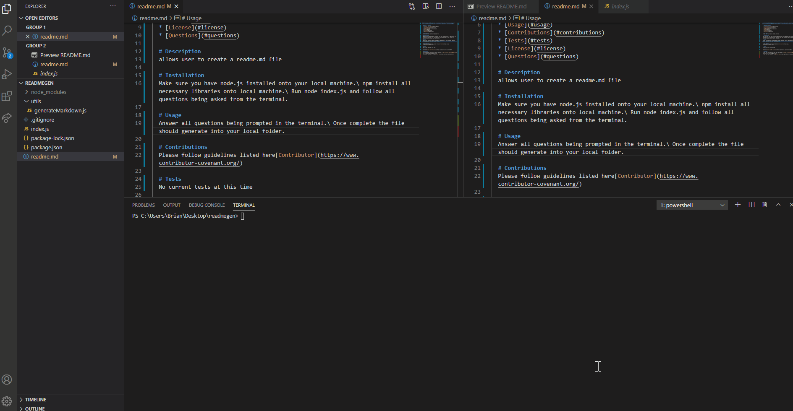

# Professional README Generator 

  # Table of Contents
  * [Project Description](#description)
  * [Installation](#installation)
  * [Usage](#usage)
  * [Contributions](#contributions)
  * [Tests](#tests)
  * [License](#license)
  * [Questions](#questions)
  
  # Description
  allows user to create a readme.md file

  # Installation
  Make sure you have node.js installed onto your local machine.\ npm install all necessary libraries onto local machine.\ Run node index.js and follow all questions being asked from the terminal.

  # Usage
  Answer all questions being prompted in the terminal.\ Once complete the file should generate into your local folder.
   / ! 

  # Contributions
  Please follow guidelines listed here[Contributor](https://www.contributor-covenant.org/)

  # Tests
  No current tests at this time

  # License
  [Released under the MIT license](https://opensource.org/licenses/MIT)

  # Questions
  If you have any questions, you can reach me at [mr.brian.mrs.kathleen@gmail.com](mr.brian.mrs.kathleen@gmail.com)
  or you can reach me at at my [github repo](https://github.com/BrianSales)

